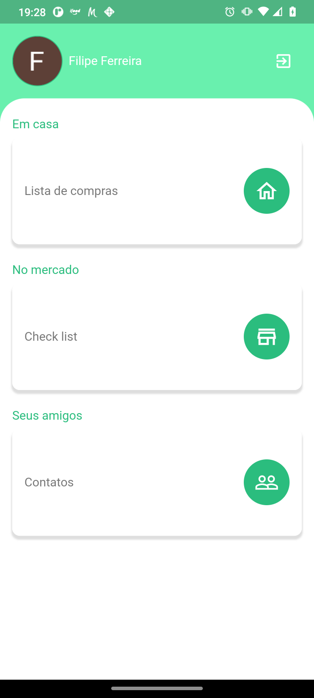
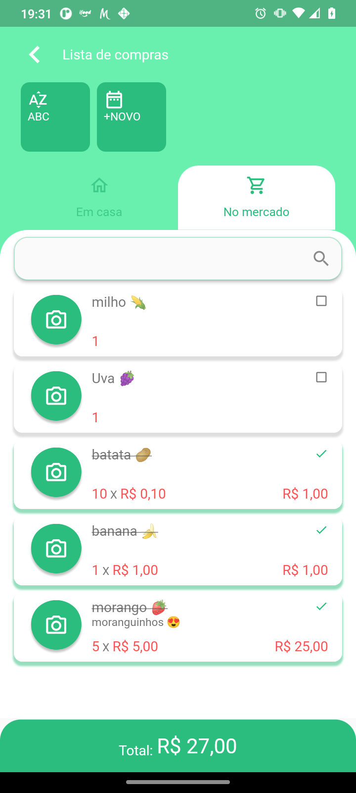
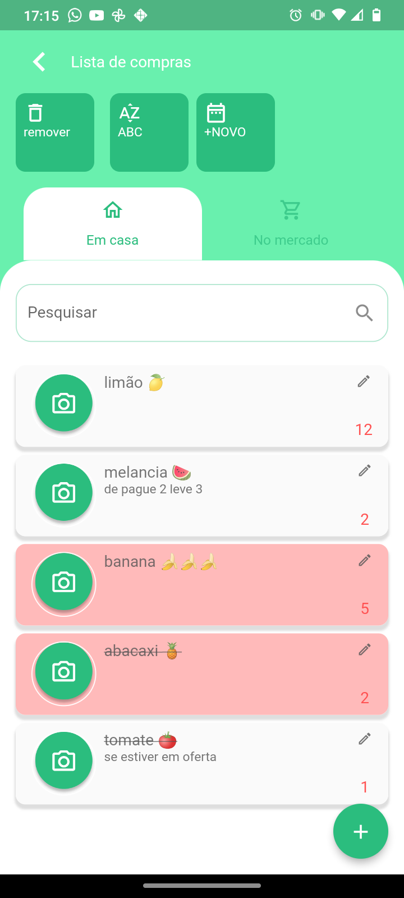
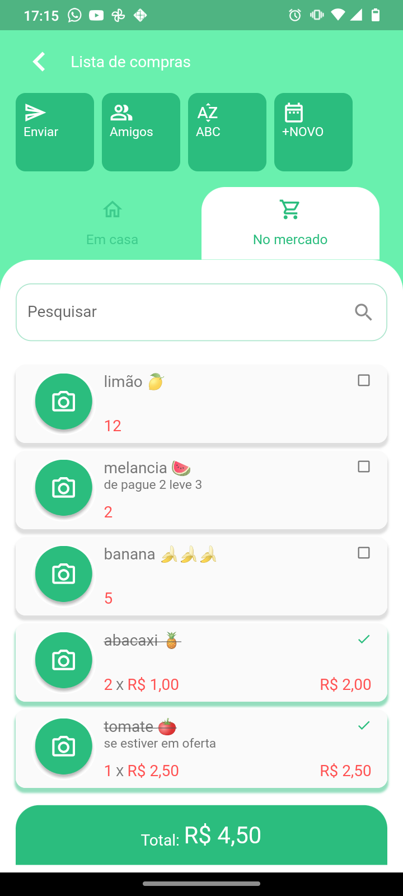

# lista_de_compras

### Um App feito para praticar componentização e serviços do firebase em  flutter

## Mais sobre o projeto

Projeto no figma https://www.figma.com/file/Lq5FiC5N9sEdV5bCHqKtYq/Lista-de-compras

#### Ilustrações

     

#### Para rodar este projeto:

1 - Use flutter 2.8.0

2 - Crie o seu arquivo de local.properties dentro do diretório android:

    sdk.dir=C:\\Users\\Filipe\\AppData\\Local\\Android\\Sdk
    flutter.sdk=C:\\sdk\\flutter
    flutter.buildMode=release
    flutter.versionName=0.1.5
    flutter.minSdkVersion=19
    flutter.targetSdkVersion=30
    flutter.compileSdkVersion=30
    storePassword=suaSenha
    keyPassword=suaSenha
    keyAlias=upload
    storeFile=C:\\Users\\YourUser\\keys\\upload-keystore.jks
    flutter.versionCode=20

3 - Configure o arquivo google-services.json do firebase(sim você precisa criar uma conta no firebase) contanto que rodará o projeto em dispositivos android;

4 - Também é necesário obter código sha-1(SHA certificate fingerprint) gerado pelo gradle para configurar o firebase authentication/googlesignin.

5 - Contando que este app usa o firebase para armazenamento de dados, não se esqueça de criar regras se gurança no firestore.

6 - Veja mais sobre configurações do firebase em https://firebase.flutter.dev/docs/manual-installation e em seguida habilite o uso do auth, firestore, crashlytcs e analytcs.